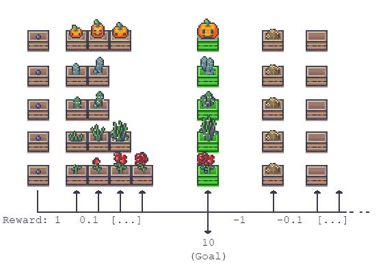
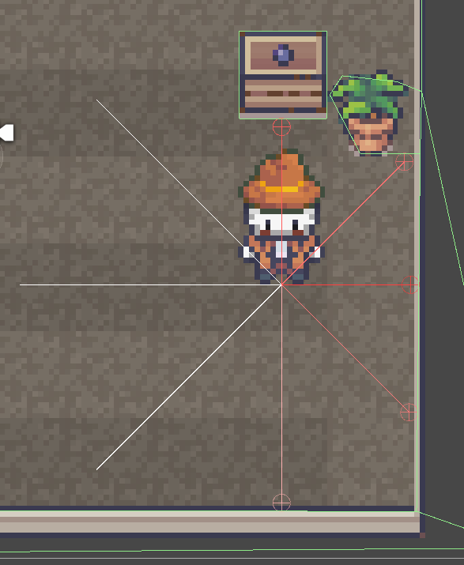

# Gardening Agent
 My tests with Unity's ML agents in a 2D environment.

## Current Status:
Acceptable agent that can maintain plants in different positions.  

  
  
### Training:

**Extrinsic rewards and curiosity:**  

Trained for 30 minutes on CPU  
about 1.1 M steps  
Cumulative Reward (1.1M steps) 9.94  

***With gail, extrinsic rewards and curiosity***  
*Cumulative Reward (1.1M steps) 2.4  
(Probably my demonstration data was not fitting.)*

## Next Steps:
Plants can die and thus give the agent negative rewards again. 

## The Agent
### Goal: 
Bring all plants to the maximum growth stage.  
Agent only needs to collide with a plant to take care of it and does not need to perform any other actions.

### Prevent:
Run into obstacles. Overgrooming plants.  

  

### Actions:
**2 Continuos Actions**  
Range -1 to 1  
Resembles movement in the x and y directions.  

**Ray Perception Sensor (2D)**  
Can detect Collider with the tags: border, plant, plantHappy  
8 Rays  
In every direction agent can walk  
(Perhaps I should extend the raycasts so that the agent has an overview of the entire environment. However, I didn't want to make it so easy for him yet.)  
  

### Hyperparameters for brains
Brain 6 is preconfigured in this Unity Project.  
See config/configurationBrain4.yaml

## Assets:
The assets in my example are not meant to be distributed, so I have replaced them with example assets.  
Original asset: https://limezu.itch.io/
