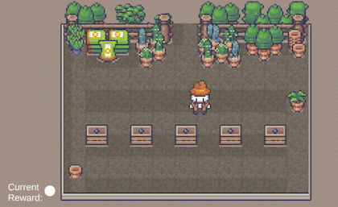

# Gardening Agent
 My tests with Unity's ML agents in a 2D environment.

## Current Status:
Overfitted agent on the current problem.  
  

## Next Steps:
Train in variants of the environment.

## The Agent
### Goal: 
Bring all plants to the maximum growth stage.

### Prevent:
Run into obstacles. Overgrooming plants.

### Actions:
**2 Continuos Actions**  
Range -1 to 1  
Resembles movement in the x and y directions.  

**Ray Perception Sensor (2D)**  
Can detect Collider with the tags: border, plant, plantHappy  
7 Rays  
View direction of Agent (-Y)  

### Hyperparameters for brain 4
Brain 4 is preconfigured in this Unity Project.  
See config/configurationBrain4.yaml

## Assets:
The assets in my example are not meant to be distributed, so I have replaced them with example assets.  
Original asset: https://limezu.itch.io/
